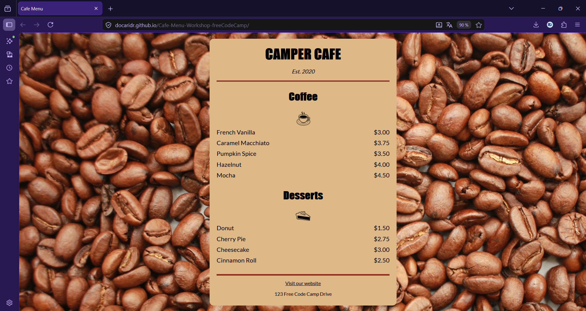

# Cafe Menu — Exercice CSS de mise en page d'un menu de café

> Exercice CSS consistant à créer une page de menu de café stylisée, réalisé dans le cadre du parcours **Responsive Web Design** de freeCodeCamp.

---

## Aperçu

---

## Technologies

---

## Ce que j'ai appris

- **Modèle de boîte CSS** — utilisation de `margin`, `padding`, `width` et `max-width` pour centrer et contraindre un conteneur, sans dépendre de la largeur de l'écran.
- **`display: inline-block`** — alignement de deux éléments `
` côte à côte sur la même ligne pour obtenir un layout nom/prix, sans recourir à Flexbox ou Grid.
- **CSS externe & sélecteurs combinés** — séparation claire du style et du contenu, et ciblage précis avec des sélecteurs descendants (`.item p`) et des classes utilitaires (`.flavor`, `.price`).

---

## Démo en ligne

 [Voir le projet sur GitHub Pages](https://docaridr.github.io/Cafe-Menu-Workshop-freeCodeCamp/)

---

## Auteur

**RicardoDev** · [DocariDR](https://github.com/DocariDR) · Cotonou, Bénin